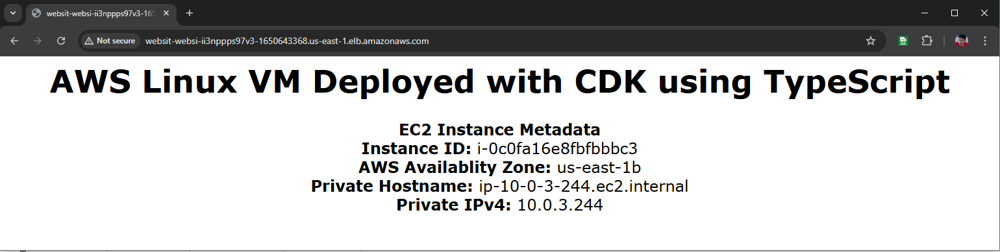
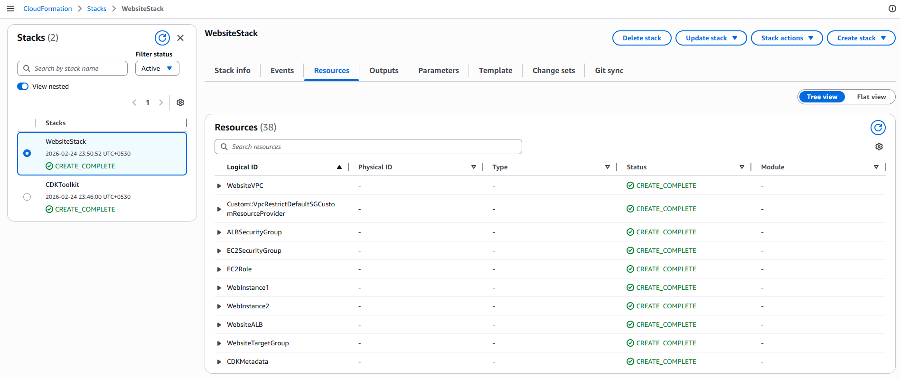

# Building Scalable Web Infrastructure on AWS with CDK in TypeScript

## Introduction

Infrastructure as Code (IaC) has revolutionized how we provision and manage cloud resources. In our previous blog post, we built a highly available web infrastructure using AWS CDK with Python. We explored the fundamentals of CDK, CloudFormation integration, and deployed a production-ready architecture with EC2 instances behind an Application Load Balancer.

In this tutorial, we'll deploy the exact same architecture, but this time using TypeScript as our CDK language. This gives you the opportunity to:

- Compare Python and TypeScript approaches to infrastructure as code
- Understand how CDK provides a consistent experience across different programming languages
- Choose the language that best fits your team's expertise and preferences
- See how type safety and IDE support differ between languages

Whether you're a JavaScript/TypeScript developer looking to manage infrastructure in a familiar language, or you're exploring different CDK language options, this guide will show you how TypeScript brings strong typing, excellent IDE support, and a robust ecosystem to your infrastructure code.

## Architecture Overview

We'll build a highly available web infrastructure with the following components:
```
┌─────────────────────────────────────────────────────────────────────┐
│                            Internet                                 │
└────────────────────────────────┬────────────────────────────────────┘
                                 │
                                 ▼
                    ┌────────────────────────┐
                    │   Internet Gateway     │
                    └────────────────────────┘
                                 │
┌────────────────────────────────┼────────────────────────────────────┐
│                                │                  VPC               │
│                                ▼                                    │
│  ┌─────────────────────────────────────────────────────────────┐    │
│  │          Application Load Balancer (ALB)                    │    │
│  │                  (Public Subnets)                           │    │
│  └──────────────────────┬──────────────────┬───────────────────┘    │
│                         │                  │                        │
│  ┌──────────────────────┼──────────────────┼─────────────────────┐  │
│  │  Availability Zone 1 │                  │ Availability Zone 2 │  │
│  │                      │                  │                     │  │
│  │  ┌───────────────────▼────────────┐  ┌──▼──────────────────┐  │  │
│  │  │   Public Subnet (AZ-1)         │  │ Public Subnet (AZ-2)│  │  │
│  │  │                                │  │                     │  │  │
│  │  │  ┌──────────────────┐          │  │                     │  │  │
│  │  │  │  NAT Gateway     │          │  │                     │  │  │
│  │  │  └────────┬─────────┘          │  │                     │  │  │
│  │  └───────────┼────────────────────┘  └─────────────────────┘  │  │
│  │              │                                                │  │
│  │  ┌───────────▼────────────────┐  ┌────────────────────────┐   │  │
│  │  │   Private Subnet (AZ-1)    │  │  Private Subnet (AZ-2) │   │  │
│  │  │                            │  │                        │   │  │
│  │  │  ┌──────────────────┐      │  │  ┌──────────────────┐  │   │  │
│  │  │  │  EC2 Instance 1  │      │  │  │  EC2 Instance 2  │  │   │  │
│  │  │  │                  │      │  │  │                  │  │   │  │
│  │  │  │                  │      │  │  │                  │  │   │  │
│  │  │  └──────────────────┘      │  │  └──────────────────┘  │   │  │
│  │  │                            │  │                        │   │  │
│  │  └────────────────────────────┘  └────────────────────────┘   │  │
│  │                                                               │  │
│  └───────────────────────────────────────────────────────────────┘  │
│                                                                     │
└─────────────────────────────────────────────────────────────────────┘

```
## Building the Infrastructure

### Step 1: Project Setup

First, ensure you have the prerequisites installed:

```bash
# Install Node.js and npm (if not already installed)
# Install AWS CDK CLI globally
npm install -g aws-cdk

# Verify installation
cdk --version
```

### Step 2: Initialize the Project

```bash
# Initialize CDK project (TypeScript example)
cdk init app --language=typescript

# Install dependencies
npm install
```

### Step 3: Bootstrap Your AWS Environment

Before deploying CDK applications, you need to bootstrap your AWS environment. This creates necessary resources like an S3 bucket for storing templates and IAM roles for deployments.

```bash
# Bootstrap CDK (one-time per account/region)
cdk bootstrap
```
```bash
>cdk bootstrap
Deploying to account: 197317184204, region: us-east-1
 ⏳  Bootstrapping environment aws://197317184204/us-east-1...
Trusted accounts for deployment: (none)
Trusted accounts for lookup: (none)
Using default execution policy of 'arn:aws:iam::aws:policy/AdministratorAccess'. Pass '--cloudformation-execution-policies' to customize.
CDKToolkit: creating CloudFormation changeset...
CDKToolkit |  0/12 | 11:46:00 pm | REVIEW_IN_PROGRESS   | AWS::CloudFormation::Stack | CDKToolkit User Initiated
.
.
.
CDKToolkit | 12/12 | 11:46:51 pm | CREATE_COMPLETE      | AWS::CloudFormation::Stack | CDKToolkit 
 ✅  Environment aws://197317184204/us-east-1 bootstrapped.
```


### Step 4: Review the Infrastructure Code

### Creating the VPC

The VPC is configured with 2 Availability Zones, public subnets for the load balancer, and private subnets for EC2 instances:

```typescript
// Create VPC with public and private subnets
const vpc = new ec2.Vpc(this, 'WebsiteVPC', {
  maxAzs: 2,
  natGateways: 1,
  subnetConfiguration: [
    {
      name: 'PublicSubnet',
      subnetType: ec2.SubnetType.PUBLIC,
      cidrMask: 24
    },
    {
      name: 'PrivateSubnet',
      subnetType: ec2.SubnetType.PRIVATE_WITH_EGRESS,
      cidrMask: 24
    }
  ]
});
```

### Security Groups

We create two security groups: one for the ALB (allowing internet traffic) and one for EC2 instances (allowing traffic only from the ALB):

```typescript
// Security group for ALB (public-facing)
const albSecurityGroup = new ec2.SecurityGroup(this, 'ALBSecurityGroup', {
  vpc: vpc,
  description: 'Security group for Application Load Balancer',
  allowAllOutbound: true
});

albSecurityGroup.addIngressRule(
  ec2.Peer.anyIpv4(),
  ec2.Port.tcp(80),
  'Allow HTTP traffic from internet'
);

// Security group for EC2 instances (private)
const ec2SecurityGroup = new ec2.SecurityGroup(this, 'EC2SecurityGroup', {
  vpc: vpc,
  description: 'Security group for EC2 instances',
  allowAllOutbound: true
});

ec2SecurityGroup.addIngressRule(
  albSecurityGroup,
  ec2.Port.tcp(80),
  'Allow HTTP traffic from ALB'
);
```

### IAM Role for EC2

The IAM role allows EC2 instances to be managed via AWS Systems Manager:

```typescript
// IAM role for EC2 instances
const ec2Role = new iam.Role(this, 'EC2Role', {
  assumedBy: new iam.ServicePrincipal('ec2.amazonaws.com'),
  managedPolicies: [
    iam.ManagedPolicy.fromAwsManagedPolicyName('AmazonSSMManagedInstanceCore')
  ]
});
```
### User Data Script

The user data script installs Apache and creates a dynamic webpage:
```typescript
// User data script to install and configure web server
const userData = ec2.UserData.forLinux();
userData.addCommands(
  'yum update -y',
  'yum install -y httpd',
  'systemctl start httpd',
  'systemctl enable httpd',
  'TOKEN=$(curl --request PUT "http://169.254.169.254/latest/api/token" --header "X-aws-ec2-metadata-token-ttl-seconds: 3600")',
  'instanceId=$(curl -s http://169.254.169.254/latest/meta-data/instance-id --header "X-aws-ec2-metadata-token: $TOKEN")',
  'echo "<h1>AWS Linux VM Deployed with CDK</h1>" > /var/www/html/index.html',
  'echo "<p>Instance ID: $instanceId</p>" >> /var/www/html/index.html'
);
```
### Creating EC2 Instances

We create 2 EC2 instances distributed across different Availability Zones:
```typescript
// Create EC2 instances in different AZs
const instance1 = new ec2.Instance(this, 'WebInstance1', {
  vpc: vpc,
  instanceType: ec2.InstanceType.of(ec2.InstanceClass.T3, ec2.InstanceSize.MICRO),
  machineImage: ec2.MachineImage.latestAmazonLinux2023(),
  securityGroup: ec2SecurityGroup,
  role: ec2Role,
  userData: userData,
  vpcSubnets: {
    subnets: [privateSubnets.subnets[0]]
  },
  requireImdsv2: true
});

const instance2 = new ec2.Instance(this, 'WebInstance2', {
  vpc: vpc,
  instanceType: ec2.InstanceType.of(ec2.InstanceClass.T3, ec2.InstanceSize.MICRO),
  machineImage: ec2.MachineImage.latestAmazonLinux2023(),
  securityGroup: ec2SecurityGroup,
  role: ec2Role,
  userData: userData,
  vpcSubnets: {
    subnets: [privateSubnets.subnets[1]]
  },
  requireImdsv2: true
});
```

### Application Load Balancer

Finally, we create the ALB with a target group and listener:

```typescript
// Application Load Balancer
const alb = new elbv2.ApplicationLoadBalancer(this, 'WebsiteALB', {
  vpc: vpc,
  internetFacing: true,
  securityGroup: albSecurityGroup,
  vpcSubnets: {
    subnetType: ec2.SubnetType.PUBLIC
  }
});

// Target group with health checks
const targetGroup = new elbv2.ApplicationTargetGroup(this, 'WebsiteTargetGroup', {
  vpc: vpc,
  port: 80,
  protocol: elbv2.ApplicationProtocol.HTTP,
  targets: [
    new elbv2_targets.InstanceTarget(instance1, 80),
    new elbv2_targets.InstanceTarget(instance2, 80)
  ],
  healthCheck: {
    path: '/',
    interval: cdk.Duration.seconds(30)
  }
});

// Listener
alb.addListener('WebsiteListener', {
  port: 80,
  protocol: elbv2.ApplicationProtocol.HTTP,
  defaultTargetGroups: [targetGroup]
});
```

### CloudFormation Outputs

We define outputs to easily access important resource information:
```typescript
// Outputs
new cdk.CfnOutput(this, 'LoadBalancerDNS', {
  value: alb.loadBalancerDnsName,
  description: 'DNS name of the load balancer'
});
```

### Step 5: Deploy the Infrastructure

Preview the CloudFormation template that CDK will generate:
```bash
cdk synth
```

Deploy the stack to AWS:
```bash
cdk deploy
```
CDK will show you the changes and ask for confirmation. Type y to proceed.

The deployment takes approximately 5–10 minutes. Once complete, you’ll see outputs including:

The deployment process:
1. CDK synthesizes your code into CloudFormation templates
2. Templates are uploaded to the bootstrap S3 bucket
3. CloudFormation creates a change set
4. Resources are provisioned in dependency order
5. Outputs are displayed (including the load balancer URL)

```bash
>cdk deploy
Deploying to account: 197317184204, region: us-east-1

✨  Synthesis time: 10.91s

WebsiteStack: start: Building WebsiteStack/Custom::VpcRestrictDefaultSGCustomResourceProvider Code
WebsiteStack: success: Built WebsiteStack/Custom::VpcRestrictDefaultSGCustomResourceProvider Code
WebsiteStack: start: Building WebsiteStack Template
WebsiteStack: success: Built WebsiteStack Template
WebsiteStack: start: Publishing WebsiteStack/Custom::VpcRestrictDefaultSGCustomResourceProvider Code (197317184204-us-east-1-78ffe0b8)
WebsiteStack: start: Publishing WebsiteStack Template (197317184204-us-east-1-0ae3e5c9)
WebsiteStack: success: Published WebsiteStack/Custom::VpcRestrictDefaultSGCustomResourceProvider Code (197317184204-us-east-1-78ffe0b8)
WebsiteStack: success: Published WebsiteStack Template (197317184204-us-east-1-0ae3e5c9)
Stack WebsiteStack
IAM Statement Changes
┌───┬──────────────────────────────────────────────────────────────┬────────┬──────────────────────────────────────────────────────────────┬────────────────────────────────────────────────────────────────┬───────────┐
│   │ Resource                                                     │ Effect │ Action                                                       │ Principal                                                      │ Condition │
├───┼──────────────────────────────────────────────────────────────┼────────┼──────────────────────────────────────────────────────────────┼────────────────────────────────────────────────────────────────┼───────────┤ 
│ + │ ${Custom::VpcRestrictDefaultSGCustomResourceProvider/Role.Ar │ Allow  │ sts:AssumeRole                                               │ Service:lambda.amazonaws.com                                   │           │ 
│   │ n}                                                           │        │                                                              │                                                                │           │ 
├───┼──────────────────────────────────────────────────────────────┼────────┼──────────────────────────────────────────────────────────────┼────────────────────────────────────────────────────────────────┼───────────┤
│ + │ ${EC2Role.Arn}                                               │ Allow  │ sts:AssumeRole                                               │ Service:ec2.amazonaws.com                                      │           │ 
├───┼──────────────────────────────────────────────────────────────┼────────┼──────────────────────────────────────────────────────────────┼────────────────────────────────────────────────────────────────┼───────────┤ 
│ + │ arn:aws:ec2:us-east-1:197317184204:security-group/${WebsiteV │ Allow  │ ec2:AuthorizeSecurityGroupEgress                             │ AWS:${Custom::VpcRestrictDefaultSGCustomResourceProvider/Role} │           │ 
│   │ PC.DefaultSecurityGroup}                                     │        │ ec2:AuthorizeSecurityGroupIngress                            │                                                                │           │ 
│   │                                                              │        │ ec2:RevokeSecurityGroupEgress                                │                                                                │           │ 
│   │                                                              │        │ ec2:RevokeSecurityGroupIngress                               │                                                                │           │ 
└───┴──────────────────────────────────────────────────────────────┴────────┴──────────────────────────────────────────────────────────────┴────────────────────────────────────────────────────────────────┴───────────┘ 
IAM Policy Changes
┌───┬────────────────────────────────────────────────────────────┬──────────────────────────────────────────────────────────────────────────────────────────────┐
│   │ Resource                                                   │ Managed Policy ARN                                                                           │
├───┼────────────────────────────────────────────────────────────┼──────────────────────────────────────────────────────────────────────────────────────────────┤
│ + │ ${Custom::VpcRestrictDefaultSGCustomResourceProvider/Role} │ {"Fn::Sub":"arn:${AWS::Partition}:iam::aws:policy/service-role/AWSLambdaBasicExecutionRole"} │
├───┼────────────────────────────────────────────────────────────┼──────────────────────────────────────────────────────────────────────────────────────────────┤
│ + │ ${EC2Role}                                                 │ arn:${AWS::Partition}:iam::aws:policy/AmazonSSMManagedInstanceCore                           │
└───┴────────────────────────────────────────────────────────────┴──────────────────────────────────────────────────────────────────────────────────────────────┘
Security Group Changes
┌───┬─────────────────────────────┬─────┬────────────┬─────────────────────────────┐
│   │ Group                       │ Dir │ Protocol   │ Peer                        │
├───┼─────────────────────────────┼─────┼────────────┼─────────────────────────────┤
│ + │ ${ALBSecurityGroup.GroupId} │ In  │ TCP 80     │ Everyone (IPv4)             │
│ + │ ${ALBSecurityGroup.GroupId} │ In  │ TCP 443    │ Everyone (IPv4)             │
│ + │ ${ALBSecurityGroup.GroupId} │ Out │ Everything │ Everyone (IPv4)             │
├───┼─────────────────────────────┼─────┼────────────┼─────────────────────────────┤
│ + │ ${EC2SecurityGroup.GroupId} │ In  │ TCP 80     │ ${ALBSecurityGroup.GroupId} │
│ + │ ${EC2SecurityGroup.GroupId} │ Out │ Everything │ Everyone (IPv4)             │
└───┴─────────────────────────────┴─────┴────────────┴─────────────────────────────┘
(NOTE: There may be security-related changes not in this list. See https://github.com/aws/aws-cdk/issues/1299)


"--require-approval" is enabled and stack includes security-sensitive updates: 'Do you wish to deploy these changes' (y/n) y
WebsiteStack: deploying... [1/1]
WebsiteStack: creating CloudFormation changeset...
WebsiteStack |  0/39 | 11:50:52 pm | REVIEW_IN_PROGRESS   | AWS::CloudFormation::Stack                | WebsiteStack User Initiated
.
.
.
WebsiteStack | 39/39 | 11:54:14 pm | CREATE_COMPLETE      | AWS::CloudFormation::Stack                | WebsiteStack 

 ✅  WebsiteStack

✨  Deployment time: 213.29s

Outputs:
WebsiteStack.Instance1Id = i-09fcc8032aee32aa0
WebsiteStack.Instance2Id = i-0c0fa16e8fbfbbbc3
WebsiteStack.LoadBalancerDNS = Websit-Websi-Ii3nPppS97V3-1650643368.us-east-1.elb.amazonaws.com
WebsiteStack.VPCId = vpc-0caf658a5e29d540d
Stack ARN:
arn:aws:cloudformation:us-east-1:197317184204:stack/WebsiteStack/8d7fe6a0-11ad-11f1-abb0-0affee6835c3

✨  Total time: 224.2s
```

### Step 6: Test Your Application

Open the LoadBalancerDNS URL in your browser to see your website. Refresh multiple times to see traffic distributed across different instances in different availability zones.




### Step 7: Explore Your Infrastructure

View the CloudFormation stack in the AWS Console:
1. Navigate to CloudFormation service
2. Find the `WebsiteStack` stack
3. Explore Resources, Events, and Outputs tabs




## Cleanup

To avoid ongoing AWS charges, destroy the infrastructure when you're done:

```bash
# Delete all resources
cdk destroy

# Confirm deletion when prompted
```

This removes all resources created by the stack. CloudFormation ensures clean deletion in the correct order, handling dependencies automatically.

**Note**: The bootstrap resources (S3 bucket, IAM roles) are not deleted by `cdk destroy`. These are shared across all CDK applications in your account and should be kept for future use.

## Project Structure

Understanding the CDK project structure helps you navigate and organize your infrastructure code effectively:

```
aws-cdk-website/
├── bin/
│   └── app.ts                    # CDK app entry point - defines stacks
├── lib/
│   └── website-stack.ts          # Main stack with VPC, EC2, ALB resources
├── node_modules/                 # npm dependencies (auto-generated)
├── cdk.out/                      # Synthesized CloudFormation templates
├── cdk.json                      # CDK toolkit configuration
├── cdk.context.json              # CDK context values (auto-generated)
├── package.json                  # Node.js project dependencies and scripts
├── package-lock.json             # Locked dependency versions
├── tsconfig.json                 # TypeScript compiler configuration
```

### Key Files Explained:

**bin/app.ts** - Application entry point where you instantiate your CDK app and stacks:
```typescript
#!/usr/bin/env node
import 'source-map-support/register';
import * as cdk from 'aws-cdk-lib';
import { WebsiteStack } from '../lib/website-stack';

const app = new cdk.App();
new WebsiteStack(app, 'WebsiteStack', {
  env: { 
    account: process.env.CDK_DEFAULT_ACCOUNT, 
    region: process.env.CDK_DEFAULT_REGION 
  }
});
```

**lib/website-stack.ts** - Contains your infrastructure definitions (VPC, EC2, ALB, security groups, etc.)

**cdk.json** - Configures how the CDK toolkit executes your app:
```json
{
  "app": "npx ts-node --prefer-ts-exts bin/app.ts",
  "context": {
    "@aws-cdk/core:enableStackNameDuplicates": true,
    "aws-cdk:enableDiffNoFail": true
  }
}
```

**package.json** - Defines project metadata, dependencies, and useful scripts:
```json
{
  "scripts": {
    "build": "tsc",
    "watch": "tsc -w",
    "deploy": "npm run build && cdk deploy",
    "synth": "cdk synth",
    "diff": "cdk diff",
    "destroy": "cdk destroy"
  }
}
```

**cdk.out/** - Generated directory containing CloudFormation templates after running `cdk synth`. This is what actually gets deployed to AWS.


## Conclusion

We've successfully deployed the same highly available web infrastructure from our previous Python CDK tutorial, but this time using TypeScript. As you've seen, AWS CDK provides a consistent and powerful experience regardless of your language choice.

TypeScript brings several advantages to infrastructure as code:

- **Strong type safety**: Catch errors at compile time before deployment
- **Superior IDE support**: Autocomplete, inline documentation, and refactoring tools
- **Familiar syntax**: JavaScript/TypeScript developers can leverage existing knowledge
- **Rich ecosystem**: Access to npm packages and TypeScript tooling
- **Better collaboration**: Type definitions serve as living documentation

Whether you choose Python, TypeScript, or another supported language, CDK transforms infrastructure provisioning from a tedious, error-prone process into an enjoyable development experience. The combination of CDK's developer-friendly interface and CloudFormation's robust deployment engine provides the best of both worlds.

## References

- **GitHub Repository**: [aws-cdk-typescript](https://github.com/chinmayto/aws-cdk-typescript)
- **AWS CDK Documentation**: https://docs.aws.amazon.com/cdk/
